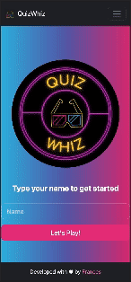
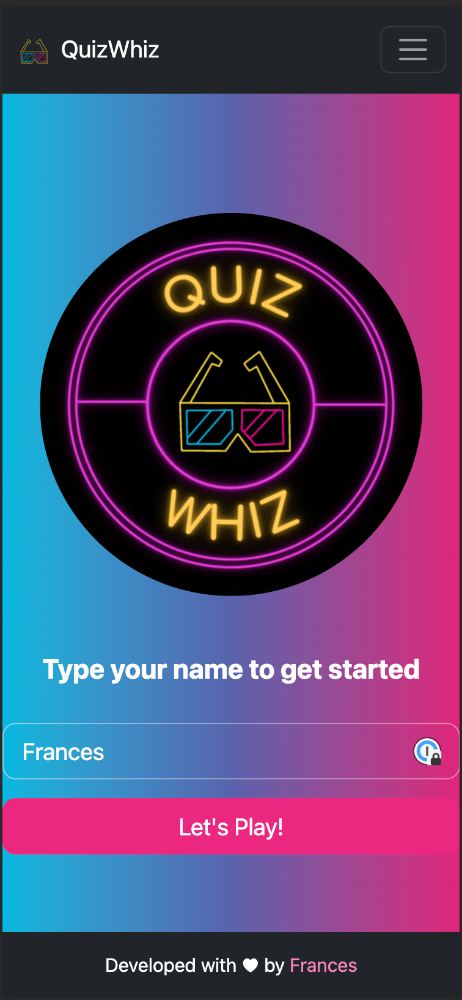
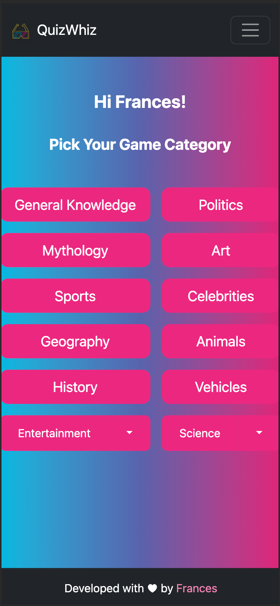
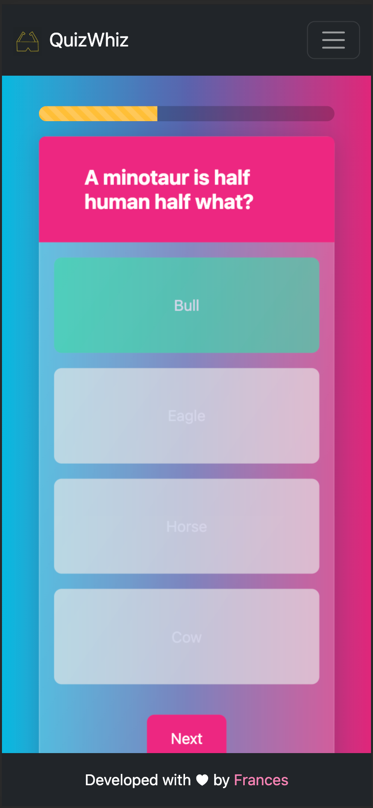
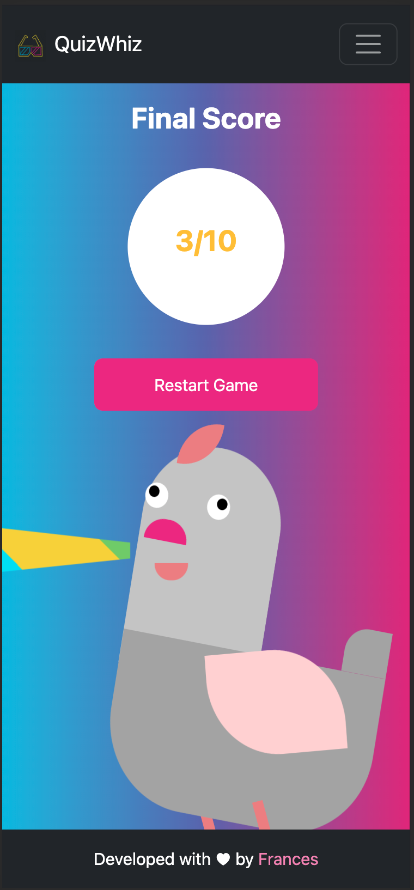

# SPA Project - Quiz

 <h3 align="center">Single Page Application</h3>

  <p align="center">
    Multiple choice Quiz Game made using HTML, CSS, Javascript, and calls to an API with Axios.
    <br />
    <a href="https://github.com/frances0688/Quiz_Project"><strong>Explore the documents »</strong></a>
    <br />
    <a href="https://github.com/frances0688/Quiz_Project/issues">Report a Bug</a>
  </p>
</div>

<!-- TABLE OF CONTENTS -->
<details>
  <summary>Table of Contents</summary>
  <ol>
        <li><a href="#preview">Preview</a></li>
        <li><a href="#objectives">Objectives</a></li>
    <li>
      <a href="#about-the-project">About The Project</a>
      <ul>
        <li><a href="#views">Views</a></li>
         <li><a href="#built-with">Built With</a></li>
      </ul>   
    </li>
    <li>
      <a href="#getting-started">Getting Started</a>
      <ul>
        <li><a href="#installation">Installation</a></li>
      </ul>
    </li>
    <li><a href="#contributing">Contributing</a></li>
    <li><a href="#license">License</a></li>
    <li><a href="#contact">Contact</a></li>
  </ol>
</details>

<!-- PREVIEW -->

## Preview

- General overview gif



<!-- ABOUT THE OBJECTIVES -->

## Objectives

### The purpose of this project is creating a quiz game application using the knowledge gained throughout the bootcamp as of now and fulfilling the following requirements:

- DOM manipulation
- Creation of a Single Page Application (SPA) to present the content
- Usage of ES6
- Asynchronous requests to an API
- Usage of Bootstrap framework
- Practice to improve and increase Git knowledge

<!-- ABOUT THE PROJECT -->

## About The Project

This project consists on the creation of a quiz game application and showing the right and wrong answers.

- The quiz consists on 10 questions. The questions are displayed one at a time, they have 4 possible answers, and only one of them is correct.
- The resulting score is displayed at the end of the game.
- All questions are retrieved making requests to the https://opentdb.com/ API.
- The application is a SPA (single-page application).
- The styling was created with Bootstrap framework.

### Views

<views>
  <ol>
    <li>Home</li>
    
    <li>Categories</li>
    
    <li>Game</li>
    
    <li>Results</li>
    
  </ol>
</views>

<p align="right">(<a href="#spa-project---quiz">back to top</a>)</p>

### Built With

- [![HTML5][HTML5]][HTML5-url]
- [![CSS3][CSS3]][CSS3-url]
- [![JS][JS]][JS-url]
- [![Bootstrap][Bootstrap]][Bootstrap-url]

<p align="right">(<a href="#spa-project---quiz">back to top</a>)</p>

<!-- GETTING STARTED -->

## Getting Started

This is an example of how you may give instructions on setting up your project locally.
To get a local copy up and running follow these simple example steps.

### Installation

Below is an example of how you can instruct your audience on installing and setting up your app.

1. Clone the repo
   ```sh
   git clone https://github.com/frances0688/Quiz_Project.git
   ```
2. Ready to start!

   Open index.html file in browser.

<p align="right">(<a href="#spa-project---quiz">back to top</a>)</p>

<!-- CONTRIBUTING -->

## Contributing

Contributions are what make the open source community such an amazing place to learn, inspire, and create. Any contributions you make are **greatly appreciated**.

If you have a suggestion that would make this better, please fork the repo and create a pull request. You can also simply open an issue with the tag "enhancement".
Don't forget to give the project a star! Thanks again!

1. Fork the Project
2. Create your Feature Branch (`git checkout -b feature/YourName`)
3. Commit your Changes (`git commit -m 'Add some YourName'`)
4. Push to the Branch (`git push origin feature/YourName`)
5. Open a Pull Request

<p align="right">(<a href="#spa-project---quiz">back to top</a>)</p>

<!-- LICENSE -->

## License

This project is under license of Frances Morales Velilla

<p align="right">(<a href="#spa-project---quiz">back to top</a>)</p>

<!-- CONTACT -->

## Contact

  <p align="center">
Frances Morales Velilla

<a href = "mailto:frances0688@gmail.com"></a>
<a href="https://www.linkedin.com/in/frances-morales/" target="_blank"></a>

</p>

<p align="right">(<a href="#spa-project---quiz">back to top</a>)</p>

---

Developed by [Frances Morales Velilla](https://github.com/frances0688)

<!-- MARKDOWN LINKS & IMAGES -->
<!-- https://www.markdownguide.org/basic-syntax/#reference-style-links -->

[linkedin-shield]: https://img.shields.io/badge/-LinkedIn-black.svg?style=for-the-badge&logo=linkedin&colorB=555
[linkedin-url]: https://linkedin.com/in/frances-morales
[product-screenshot]: images/screenshot.png
[HTML5]: https://img.shields.io/badge/html5-%23E34F26.svg?style=for-the-badge&logo=html5&logoColor=white
[HTML5-url]: https://developer.mozilla.org/en-US/docs/Glossary/HTML5
[CSS3]: https://img.shields.io/badge/css3-%231572B6.svg?style=for-the-badge&logo=css3&logoColor=white
[CSS3-url]: https://developer.mozilla.org/en-US/docs/Web/CSS
[JS]: https://img.shields.io/badge/javascript-%23323330.svg?style=for-the-badge&logo=javascript&logoColor=%23F7DF1E
[JS-url]: https://developer.mozilla.org/en-US/docs/Web/JavaScript
[Bootstrap]: https://img.shields.io/badge/bootstrap-%238511FA.svg?style=for-the-badge&logo=bootstrap&logoColor=white
[Bootstrap-url]: https://getbootstrap.com/
[Next.js]: https://img.shields.io/badge/next.js-000000?style=for-the-badge&logo=nextdotjs&logoColor=white
[Next-url]: https://nextjs.org/
[React.js]: https://img.shields.io/badge/React-20232A?style=for-the-badge&logo=react&logoColor=61DAFB
[React-url]: https://reactjs.org/
[Vue.js]: https://img.shields.io/badge/Vue.js-35495E?style=for-the-badge&logo=vuedotjs&logoColor=4FC08D
[Vue-url]: https://vuejs.org/
[Angular.io]: https://img.shields.io/badge/Angular-DD0031?style=for-the-badge&logo=angular&logoColor=white
[Angular-url]: https://angular.io/
[JWT]: https://img.shields.io/badge/JWT-black?style=for-the-badge&logo=JSON%20web%20tokens
[JWT-url]: https://jwt.io/
[Vercel]: https://img.shields.io/badge/vercel-%23000000.svg?style=for-the-badge&logo=vercel&logoColor=white
[Vercel-url]: https://vercel.com/
[MongoDB]: https://img.shields.io/badge/MongoDB-%234ea94b.svg?style=for-the-badge&logo=mongodb&logoColor=white
[MongoDB-url]: https://www.mongodb.com/es
[Express.js]: https://img.shields.io/badge/express.js-%23404d59.svg?style=for-the-badge&logo=express&logoColor=%2361DAFB
[Express.js-url]: https://expressjs.com/
[Node.JS]: https://img.shields.io/badge/node.js-6DA55F?style=for-the-badge&logo=node.js&logoColor=white
[Node.JS-url]: https://nodejs.org/en/
[SASS]: https://img.shields.io/badge/SASS-pink?style=for-the-badge&logo=SASS&logoColor=white
[SASS-url]: https://sass-lang.com/
[React]: https://img.shields.io/badge/React-219ebc?style=for-the-badge&logo=React&typoColor=fedcba&logoColor=white
[React-url]: https://es.reactjs.org/
[Postman]: https://img.shields.io/badge/Postman-FF6C37?style=for-the-badge&logo=postman&logoColor=white
[Postman-url]: https://www.postman.com/
